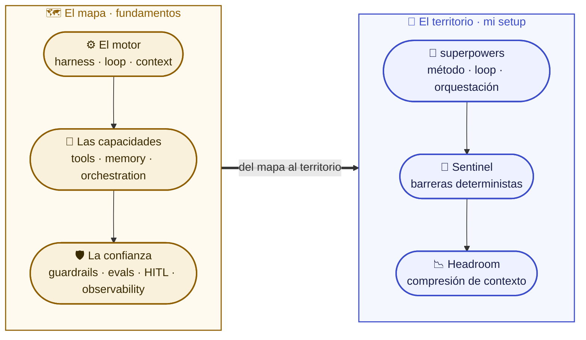

<div align="center">


-2E7D32?style=for-the-badge&logo=gnuprivacyguard&logoColor=white)


> **No es el modelo, es el método.** Dos charlas sobre ingeniería de agentes de IA (el mapa y el territorio) y un kit para replicar mi setup de Claude Code en otra máquina.

</div>

---

## Qué encontrarás aquí (léelo una vez y lo tienes todo)

Tres cosas, de lo conceptual a lo práctico:

1. **Dos charlas** autocontenidas (HTML + guion) que explican cómo se construye hoy un agente de IA de producción y cómo trabajo yo con Claude Code.
2. **Un kit transferible** (`kit/`) que instala una versión saneada de mi setup real (config, hooks, agentes, Sentinel) en cualquier máquina, con un instalador y un autodiagnóstico.
3. **Formación recomendada** al final: cursos gratis, cortos y verificados para entender la IA y, sobre todo, Claude Code.

Todo es reproducible: cada charla se abre en el navegador sin instalar nada, y el kit se instala y se verifica con tres comandos.

## 1. Las dos charlas

| Charla | Fichero | Guion | Duración | Para quién |
|--------|---------|-------|----------|------------|
| **Fundamentos** · el mapa | [`agentes-fundamentos.html`](charlas/agentes-fundamentos.html) | [`agentes-fundamentos-guion.md`](charlas/agentes-fundamentos-guion.md) | ~17-20 min | Manager técnico |
| **Setup** · el territorio | [`setup-claude-code-definitiva.html`](charlas/setup-claude-code-definitiva.html) | [`setup-claude-code-definitiva-guion.md`](charlas/setup-claude-code-definitiva-guion.md) | ~20 min | Desarrolladores |

**El mapa** explica el modelo mental de Karpathy y los diez pilares de ingeniería que hay debajo del prompt. **El territorio** enseña mi máquina de verdad (superpowers, Sentinel, Headroom) con cifras reales. Se dan seguidas, pero cada una funciona sola.

**Cómo verlas:** no hace falta servidor. Clona, y abre el `.html` en el navegador (doble clic, o `open`/`xdg-open`/`start`). Botón arriba a la derecha para alternar tema claro/oscuro.

```bash
git clone https://github.com/manuelcozar55/setup-claude-code.git
cd setup-claude-code
open charlas/agentes-fundamentos.html   # macOS · Linux: xdg-open · Windows: start
```

### El mapa: los 10 pilares

| Bloque | Pilares |
|--------|---------|
| **El motor** · la máquina que rodea al modelo | 01 Harness · 02 Loop · 03 Context |
| **Las capacidades** · qué puede hacer el agente | 04 Tools · 05 Memory · 06 Orchestration |
| **La confianza** · poder soltarlo en producción | 07 Guardrails · 08 Evals · 09 Human-in-the-loop · 10 Observability |



## 2. El kit transferible

En [`kit/`](kit/) tienes una versión **saneada y auto-verificable** de mi setup, lista para instalar en otro ordenador. Config real (CLAUDE.md, settings.json, los 8 agentes, hooks, el motor de políticas Sentinel), un instalador idempotente con backup, un autodiagnóstico y un gate de secretos, todo con TDD. Los terceros (Headroom, plugin superpowers, agent-browser, venv de tools) se documentan, no se redistribuyen.

**Instalar en tres pasos** (Linux/WSL/macOS, bash):

```bash
cd kit
bash install.sh                                   # instala en $CLAUDE_HOME (default $HOME/.claude), con backup
cp .env.example "${CLAUDE_HOME:-$HOME/.claude}"/.env   # rellena tus claves
bash doctor.sh                                    # autodiagnóstico con evidencia (PASS/WARN/FAIL)
```

Guía completa en [`kit/README.md`](kit/README.md) y [`docs/`](kit/docs/) (overview, install, headroom, superpowers, security, routine, verify).

**Seguridad:** un gate determinista (`scan-secrets.sh`) verifica que el kit no contiene ninguna clave, token ni ruta personal. Cero secretos: las claves viven en tu `.env` local, nunca en el repo.

## Estructura del repositorio

```text
setup-claude-code/
├── charlas/                                             # 1. Las dos charlas
│   ├── agentes-fundamentos.html / -guion.md             #    Charla 1: el mapa (10 pilares)
│   └── setup-claude-code-definitiva.html / -guion.md     #    Charla 2: el territorio (mi setup)
├── kit/                                                  # 2. El kit transferible
│   ├── install.sh · doctor.sh · scan-secrets.sh         #    instalar · diagnosticar · gate de secretos
│   ├── .env.example · requirements-tools.txt            #    placeholders · CLIs del venv
│   ├── claude/                                          #    CLAUDE.md, settings.json, 8 agentes, hooks, allowlist
│   ├── sentinel/                                        #    motor de políticas + iocs.example.json
│   ├── test/                                            #    tests TDD (scan/install/doctor)
│   └── docs/                                            #    01-overview .. 07-verify
├── LICENSE                                             # CC BY 4.0
└── README.md
```

## 3. Formación recomendada (gratis, corta, verificada)

Para entender la IA y, sobre todo, Claude Code. Todos gratis y de una a dos horas; contenidos y duración verificados a fecha de este repo (las plataformas pueden cambiar, confírmalo al inscribirte).

| Curso | Plataforma | Duración | Coste | De qué va |
|-------|------------|----------|-------|-----------|
| [Claude Code 101](https://www.anthropic.com/learn) | Anthropic Academy | ~1 h | Gratis | Intro oficial: instalación, flujo Explore-Plan-Code-Commit, `CLAUDE.md`, MCP. |
| [Claude Code in Action](https://anthropic.skilljar.com/claude-code-in-action) | Anthropic Academy | ~1 h · 15 clases | Gratis | Profundiza: operaciones de fichero, contexto, GitHub, hooks, SDK. Certificado. |
| [Claude Code: A Highly Agentic Coding Assistant](https://www.deeplearning.ai/courses/claude-code-a-highly-agentic-coding-assistant/) | DeepLearning.AI (con Anthropic) | ~2 h · 10 lecciones | Gratis (audit) | Práctica real: RAG chatbot, refactor, Figma a web app, subagentes, git worktrees, hooks, MCP. |
| [MCP: Build Rich-Context AI Apps with Anthropic](https://www.deeplearning.ai/courses/mcp-build-rich-context-ai-apps-with-anthropic/) | DeepLearning.AI (con Anthropic) | 1 h 58 min | Gratis (audit) | MCP a fondo: FastMCP, Inspector, cliente/servidor, despliegue. |

**Ruta sugerida:** empieza por *Claude Code 101* para el flujo básico, salta a *Claude Code in Action* para el día a día, y haz el curso de DeepLearning.AI cuando quieras práctica guiada sobre proyectos reales. El catálogo completo y gratuito de Anthropic (prompt engineering, AI Fluency, MCP) está en [anthropic.com/learn](https://www.anthropic.com/learn).

### Vídeos

Vídeos gratuitos (YouTube), elegidos por contenido, no por duración.

- **[The prompting playbook](https://youtu.be/G2B0YWuJUgI)** - guía de prompting; cómo escribir mejores instrucciones para modelos. (Extra recomendado.)
- **[Claude Code best practices (Code w/ Claude)](https://youtu.be/gv0WHhKelSE)** - charla oficial de Anthropic sobre buenas prácticas de Claude Code; refuerza el "territorio" de este repo.
- **[Context Engineering Our Way to Long-Horizon Agents - Harrison Chase (LangChain)](https://youtu.be/vtugjs2chdA)** - el cofundador de LangChain sobre ingeniería de contexto, harnesses y agentes de largo horizonte; refuerza directamente el "mapa" (loop/context engineering).

## Fuentes

Nada del mapa es opinión. Combina un modelo mental y un cuerpo de ingeniería que puedes leer en la fuente:

| Fuente | Aporta |
|--------|--------|
| **Andrej Karpathy** | El modelo mental: el LLM es la CPU, el contexto es la RAM. |
| **LangChain** · [The Art of Loop Engineering](https://www.langchain.com/blog/the-art-of-loop-engineering) | Los cuatro bucles apilados; "el potencial está en los bucles que construyes alrededor". |
| **LangChain** · [Context Engineering](https://www.langchain.com/blog/context-engineering-for-agents) | Llenar la ventana con la información justa: escribir, seleccionar, comprimir, aislar. |
| **LangChain** · [Multi-agent systems](https://www.langchain.com/blog/how-and-when-to-build-multi-agent-systems) | Herramientas y orquestación: pocas y buenas, y multi-agente solo cuando compensa. |
| **LangChain** · [Runtime / Deep Agents](https://www.langchain.com/blog/runtime-behind-production-deep-agents) | Harness frente a runtime, ejecución durable y el humano en el bucle. |
| **LangChain** · [Agent Observability & Evals](https://www.langchain.com/resources/agent-observability) | "La lógica de tu app está en las trazas, no en el código"; el eval como bucle. |
| **SwirlAI** | La estructura de los diez pilares aquí adaptada. |

## Notas de experto

- **Honestidad de fuentes.** Cada afirmación de las charlas y del kit está citada y verificada; lo que no se pudo verificar, se cortó. Cero cifras infladas.
- **Cifras del deck de setup.** Son una foto ilustrativa de mi máquina en un momento dado, no una garantía ni un dato tuyo: reprodúcelas con tus propios logs (el deck trae la tabla "cifra a fuente a comando"). `~/.ssh`, `id_rsa` o `ANTHROPIC_API_KEY` aparecen solo como objetivos de demostración de la puerta de seguridad; el repo no contiene ninguna clave real.
- **El kit se verifica a sí mismo.** Instalar, diagnosticar, corregir: un bucle, no un volcado. `doctor.sh` da evidencia por componente y `scan-secrets.sh` bloquea cualquier fuga.
- **Autocontenido y accesible.** Las charlas llevan CSS/JS inline, contraste AA en claro y oscuro, `prefers-reduced-motion`, print y JS-off muestran todo.

## Autor

**Manuel Cózar** · AI Engineer · Innovation Researcher @ Fundación CIRCE

[](https://github.com/manuelcozar55)
[](mailto:manuelcozar55@gmail.com)

## Licencia

[CC BY 4.0](LICENSE). Comparte y adapta con atribución.

<div align="center">

*El mapa antes del territorio. Y cada número, reproducible con un comando.*


</div>
