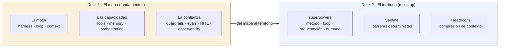

<div align="center">


> **No es el modelo, es el método.** Dos charlas hermanas: el mapa conceptual de la ingeniería de agentes de IA, y el territorio real de mi setup con Claude Code.

</div>

---

## Qué es esto

Dos presentaciones autocontenidas (HTML + CSS + JS inline, solo Google Fonts, tema claro/oscuro, sin build ni dependencias) y sus guiones hablados. Cuentan la misma historia en dos niveles:

- **El mapa** explica *cómo se construye* hoy un agente de IA de producción: el modelo mental de Karpathy y los diez pilares de ingeniería que hay debajo del prompt.
- **El territorio** enseña *mi máquina de verdad*: superpowers, Sentinel y Headroom, con cifras reales sacadas de logs y comandos.

Están pensadas para darse seguidas (primero el mapa, luego el territorio), pero cada una funciona sola.

## Las dos charlas

| Charla | Fichero | Guion | Duración | Para quién |
|--------|---------|-------|----------|------------|
| **1. Fundamentos** · el mapa | [`agentes-fundamentos.html`](agentes-fundamentos.html) | [`agentes-fundamentos-guion.md`](agentes-fundamentos-guion.md) | ~17-20 min | Manager técnico |
| **2. Setup** · el territorio | [`setup-claude-code-definitiva.html`](setup-claude-code-definitiva.html) | [`setup-claude-code-definitiva-guion.md`](setup-claude-code-definitiva-guion.md) | ~20 min | Desarrolladores |

## Cómo verlas

No hacen falta ni servidor ni instalación.

### 1. Clona el repositorio

```bash
git clone https://github.com/manuelcozar55/setup-claude-code.git
cd setup-claude-code
```

### 2. Abre la charla en el navegador

```bash
# macOS
open agentes-fundamentos.html
# Linux
xdg-open agentes-fundamentos.html
# Windows
start agentes-fundamentos.html
```

O simplemente haz doble clic en el fichero `.html`.

### 3. Preséntala

Usa el botón de arriba a la derecha para alternar tema claro/oscuro (elige y prueba el contraste en el proyector real antes de empezar). Haz scroll sección a sección al ritmo del guion.

## El mapa: los 10 pilares

La ingeniería de un agente sube por una escalera (prompt → contexto → harness → loop) y se organiza en tres bloques:

| Bloque | Pilares |
|--------|---------|
| **El motor** · la máquina que rodea al modelo | 01 Harness · 02 Loop · 03 Context |
| **Las capacidades** · qué puede hacer el agente | 04 Tools · 05 Memory · 06 Orchestration |
| **La confianza** · poder soltarlo en producción | 07 Guardrails · 08 Evals · 09 Human-in-the-loop · 10 Observability |

## Arquitectura

Cada charla mapea a la siguiente. Los diez pilares del mapa se implementan con tres piezas en el territorio.



## Fuentes

Nada del mapa es opinión. Combina un modelo mental y un cuerpo de ingeniería que puedes leer en la fuente:

| Fuente | Aporta |
|--------|--------|
| **Andrej Karpathy** | El modelo mental: el LLM es la CPU, el contexto es la RAM. |
| **LangChain** · [The Art of Loop Engineering](https://www.langchain.com/blog/the-art-of-loop-engineering) | Los cuatro bucles apilados; "el potencial está en los bucles que construyes alrededor". |
| **LangChain** · [Context Engineering](https://www.langchain.com/blog/context-engineering-for-agents) | Llenar la ventana con la información justa: escribir, seleccionar, comprimir, aislar. |
| **LangChain** · [Multi-agent systems](https://www.langchain.com/blog/how-and-when-to-build-multi-agent-systems) | Herramientas y orquestación: pocas y buenas, y multi-agente solo cuando compensa. |
| **LangChain** · [Runtime / Deep Agents](https://www.langchain.com/blog/runtime-behind-production-deep-agents) | Harness frente a runtime, ejecución durable y el humano en el bucle. |
| **LangChain** · [Agent Observability & Evals](https://www.langchain.com/resources/agent-observability) | "La lógica de tu app está en las trazas, no en el código"; el eval como bucle. |
| **SwirlAI** | La estructura de los diez pilares aquí adaptada. |

## Estructura del repositorio

```text
setup-claude-code/
├── agentes-fundamentos.html            # Charla 1: el mapa (10 pilares, fuentes citadas)
├── agentes-fundamentos-guion.md        # Guion hablado (~17-20 min)
├── agentes-fundamentos-cambios.md      # Change report de la charla 1
├── setup-claude-code-definitiva.html   # Charla 2: el territorio (mi setup real)
├── setup-claude-code-definitiva-guion.md
├── docs/superpowers/plans/             # Plan de implementación (el método, documentado)
├── LICENSE                             # CC BY 4.0
└── README.md
```

## Sobre las cifras del deck de setup

El deck de setup muestra números reales de **mi** máquina en un momento dado (eventos de auditoría, tokens comprimidos, ahorro en dólares). Son una **foto ilustrativa**, no una garantía ni un dato tuyo: reprodúcelos con tus propios logs (el propio deck trae la tabla "cifra → fuente → comando"). Las referencias a `~/.ssh`, `id_rsa` o `ANTHROPIC_API_KEY` aparecen solo como **objetivos de demostración** para enseñar que la puerta de seguridad los bloquea; el repo no contiene ninguna clave ni secreto real.

## Notas de experto

- **Honestidad de fuentes.** Cada afirmación del deck de fundamentos está citada y verificada contra la fuente original; lo que no se pudo verificar, se cortó. Cero cifras infladas.
- **Tipografía cuidada.** Comillas angulares (« ») en el HTML, sin em-dash en el cuerpo, acento ámbar propio para los fundamentos y los tres colores del setup reservados solo para el puente.
- **Autocontenido y accesible.** CSS/JS inline, contraste AA verificado en claro y oscuro, `prefers-reduced-motion`, print y JS-off muestran todo el contenido.
- **Las capturas de origen** (carpeta `data/`, capturas de WhatsApp) quedan fuera del repo por `.gitignore`: los diagramas son SVG/CSS originales, on-brand.

## Roadmap

- [ ] Versión en inglés de ambas charlas.
- [ ] Grabación de la charla como referencia.
- [ ] Diferenciar la etiqueta de fuente de los pilares 08 (Evals) y 10 (Observability) en un pase de pulido.

## Autor

**Manuel Cózar** · AI Engineer · Innovation Researcher @ Fundación CIRCE

[](https://github.com/manuelcozar55)
[](mailto:manuelcozar55@gmail.com)

## Licencia

[CC BY 4.0](LICENSE). Comparte y adapta con atribución.

<div align="center">

*El mapa antes del territorio. Y cada número, reproducible con un comando.*


</div>
