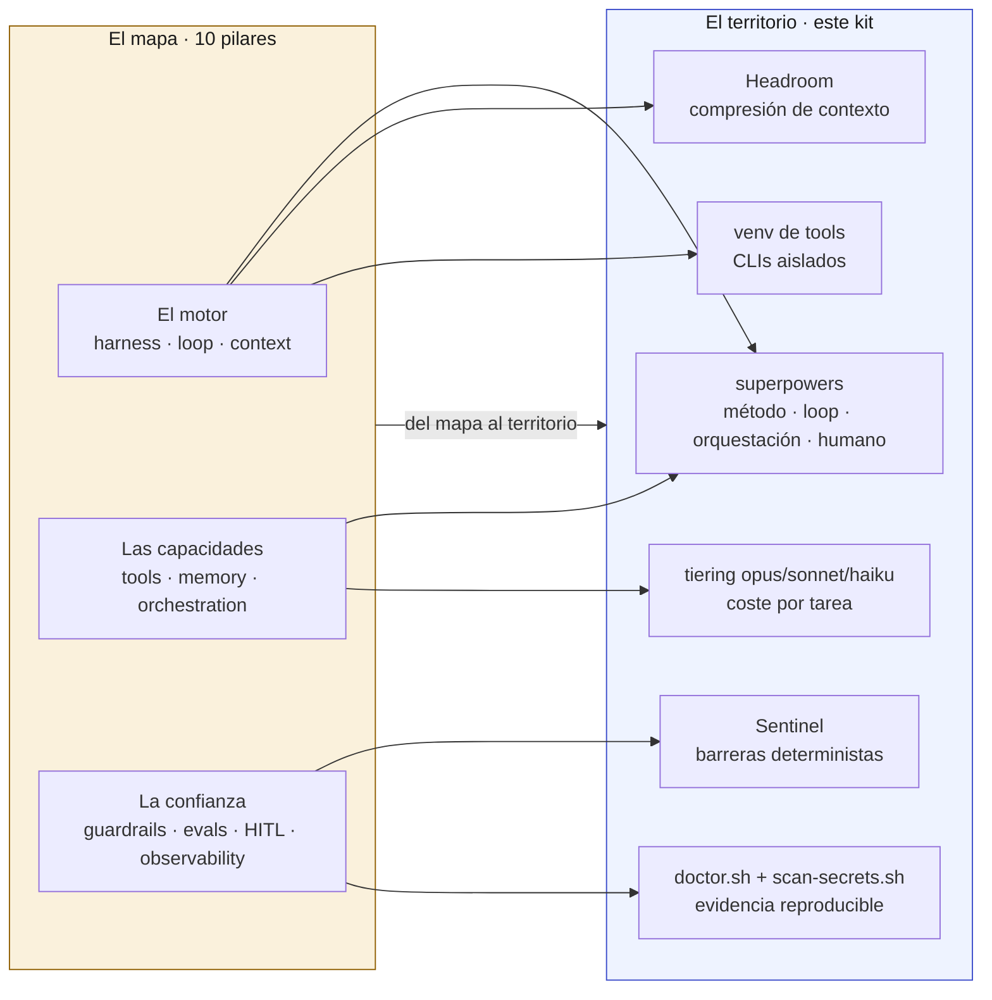

# 01 · El mapa: modelo mental y piezas reales

Este documento es el mapa. Los seis siguientes (`02` a `07`) son el territorio: instalación, terceros, seguridad, rutina y verificación de este kit en concreto. Léelo primero: si no entiendes por qué existen Sentinel, Headroom o el tiering de modelos, los pasos de instalación te van a parecer arbitrarios.

## El modelo mental (Karpathy)

Todo lo que sigue se apoya en una sola imagen, prestada de Andrej Karpathy y adoptada también por quienes construyen agentes en producción (LangChain la usa con las mismas palabras): **el LLM es la CPU, el contexto es la RAM, y el agente es el programa (el harness) que decide qué entra en esa RAM y cuándo se vacía.**

- **LLM = CPU.** Potente, pero inerte sin un programa que la dirija. Cambiar de modelo es cambiar de CPU, no de arquitectura.
- **Contexto = RAM.** Finito, se llena, y todo lo que metes en la ventana compite por el mismo espacio. Cuando se llena hay que decidir qué se descarta.
- **Spec = fuente de verdad.** Lo único que sobrevive cuando la RAM se vacía (un `/compact`, una sesión nueva) es lo que quedó escrito en disco: una spec, un plan, un fichero de handoff. Si algo importante solo vive "en la cabeza" de la conversación, se pierde en cuanto se compacta.

Este kit trata sus propios ficheros igual que una spec: `install.sh` reconstruye el estado completo en cualquier máquina a partir de lo que hay en disco, no de lo que alguien recuerde haber configurado a mano.

## Los 10 pilares, agrupados

Por debajo del prompt hay diez capas de ingeniería, organizadas en tres bloques según qué compran:

| Bloque | Pilares | Qué compra |
|---|---|---|
| **El motor** | 01 Harness · 02 Loop · 03 Context | que el sistema aguante en producción: reintentos, sandbox, límites de iteración, gestión de la ventana finita |
| **Las capacidades** | 04 Tools · 05 Memory · 06 Orchestration | qué puede hacer el agente: herramientas pocas y buenas, memoria corto/largo plazo, uno o varios agentes coordinados |
| **La confianza** | 07 Guardrails · 08 Evals · 09 Human-in-the-loop · 10 Observability | poder soltarlo sin vigilancia: barreras deterministas, medir que hace bien el trabajo, puertas de aprobación en lo irreversible, trazas de cada paso |

La regla que resume el bloque de la confianza: los guardrails no son el modelo autolimitándose, son reglas fijas que se cumplen siempre y cuya función es acotar el radio de impacto (el *blast radius*) de un fallo.

## Loop engineering: diseña el bucle, no el prompt

La escalera de ingeniería sube en cuatro peldaños: prompt, contexto, harness, loop. Cuanto más arriba, más determina el resultado, y el prompt es el peldaño con menos margen. Si un equipo solo optimiza prompts, toca techo enseguida; el valor real, y la ventaja difícil de copiar, está en las capas de abajo.

De ahí el principio que gobierna este kit: **design the loop, not the prompt.** No se trata de escribir una instrucción perfecta una vez, sino de construir un bucle que se repite con las mismas garantías cada vez: instalar, diagnosticar, corregir, reinstalar. `doctor.sh` es ese bucle de verificación; `scan-secrets.sh` es el guardarraíl determinista que lo cierra.

## Cómo encaja cada pieza real de este kit

El mapa de arriba no es teoría suelta: cada pieza que instala este kit tapa un hueco concreto.

- **superpowers** (`docs/04-superpowers.md`) pone el **método**: el bucle operativo de cuatro fases (brainstorm, plan, execute, verify), la orquestación de agentes con tiering, y las puertas de humano. Cubre los pilares de loop, orquestación y human-in-the-loop.
- **Sentinel** (`docs/05-security.md`) pone las **barreras**: un motor de políticas determinista que se ejecuta antes de cada acción, sin depender de que el modelo decida autolimitarse. Cubre el pilar de guardrails.
- **Headroom** (`docs/03-headroom.md`) cuida el **contexto y el coste**: un proxy local que comprime los resultados de herramienta antes de que lleguen al modelo, para que la ventana no se llene a mitad de una tarea larga. Cubre el pilar de contexto.
- **El venv de tools** (`docs/02-install.md`) da las **herramientas**: CLIs curados, aislados del Python del sistema, invocables por los propios hooks del kit. Cubre el pilar de tools.
- **El tiering opus/sonnet/haiku** (`docs/06-routine.md`) reparte el coste según la tarea: opus para pensar (orchestrator, strategist, planner), sonnet para ejecutar y revisar (deep-worker, los reviewers, el explorador de código), haiku para verificar barato (quick-checker). Es la expresión práctica del pilar de orquestación.
- **`doctor.sh` y `scan-secrets.sh`** (`docs/07-verify.md`) son los evals y la observabilidad de este kit: nada se da por bueno sin su comando y su salida esperada, "cifra → fuente → comando".

## Diagrama: del mapa al territorio

## Qué documenta cada doc siguiente

- **`02-install.md`**: prerrequisitos y los pasos exactos para instalar la config saneada de este kit en `CLAUDE_HOME`.
- **`03-headroom.md`**: qué es Headroom, cómo se instala y cómo se cablea el proxy.
- **`04-superpowers.md`**: el plugin superpowers, sus skills, los 8 agentes con tiering, y agent-browser.
- **`05-security.md`**: Sentinel, los guards de Bash/git, y el manejo de secretos.
- **`06-routine.md`**: la rutina diaria (tiering, ping de las 6:00, `/compact`, opus[1m], worktrees).
- **`07-verify.md`**: cómo comprobar, con evidencia, que todo lo anterior funciona de verdad.
