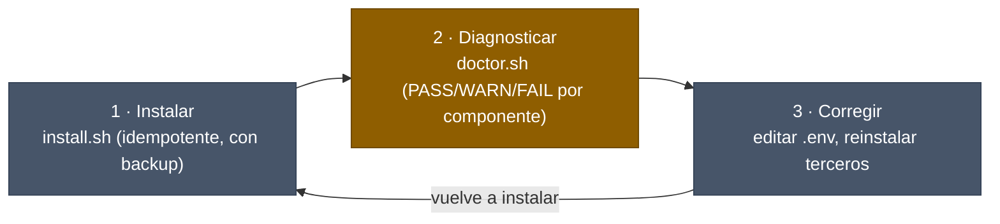

<div align="center">


> **De Headroom a la rutina, con haiku de por medio.** No es una config que se copia y ya, es un bucle que se instala, se diagnostica y se corrige a sí mismo.

</div>

---

## Qué es esto

Un kit transferible: la config saneada de `~/.claude` (`CLAUDE.md`, `settings.json`, agentes con tiering, hooks de guardarraíles), Sentinel como puerta determinista, y los scripts que instalan y verifican todo lo anterior con evidencia reproducible. No es una charla ni una demo, es la máquina real, empaquetada para que corra en otra máquina distinta a la mía.

Cubre el recorrido completo de mi setup diario: desde **Headroom** comprimiendo el contexto antes de que llegue al modelo, pasando por **superpowers** y sus ocho agentes con tiering (opus para pensar, sonnet para ejecutar, **haiku** para verificar barato), hasta la **rutina** de cada día (ping de las 6:00, `/compact`, worktrees). Cada pieza tapa un hueco concreto de los diez pilares de ingeniería de agentes; el mapa completo está en [`docs/01-overview.md`](docs/01-overview.md). Esta config es el esqueleto: la pila completa (plugins de Claude Code, servidores MCP, skills adicionales) está documentada en [`docs/08-plugins-mcp-y-skills.md`](docs/08-plugins-mcp-y-skills.md).

## Quickstart

Requiere Linux o WSL2 (`install.sh` aborta con un mensaje claro en cualquier otra plataforma; ver [`docs/02-install.md`](docs/02-install.md#prerrequisitos)).

```bash
# 1. Clona y entra en el kit
git clone https://github.com/manuelcozar55/setup-claude-code.git
cd setup-claude-code/kit

# 2. Instala la config saneada (idempotente, con backup automático)
bash install.sh

# 3. Copia las variables de entorno y rellénalas con tus claves
cp .env.example "${CLAUDE_HOME:-$HOME/.claude}"/.env
# (por defecto CLAUDE_HOME es $HOME/.claude)
$EDITOR ~/.claude/.env

# 4. Verifica la instalación con evidencia por componente
bash doctor.sh
```

`doctor.sh` sale con código 0 solo si no hay ningún `FAIL`. Un `WARN` es aceptable cuando es un componente opcional que aún no instalaste (el venv de tools, Headroom, `rtk`): el setup base funciona sin ellos, porque nada del kit los da por supuestos.

La excepción, y es un `FAIL`: si tu `settings.json` enruta la API a un proxy (`ANTHROPIC_BASE_URL`) y ahí no contesta nadie, Claude Code no puede conectar. Eso no es una degradación elegante, así que `doctor.sh` no lo deja pasar como `WARN`. Detalle completo en [`docs/02-install.md`](docs/02-install.md) y [`docs/07-verify.md`](docs/07-verify.md).

## Qué incluye

| Pieza | Contenido | Qué resuelve |
|---|---|---|
| `claude/` | `CLAUDE.md`, `settings.json`, `sentinel-allowlist.json`, `.gitleaks.toml` | la config saneada que `install.sh` copia a `CLAUDE_HOME` |
| `claude/hooks/` | guards de Bash (`block-dangerous-commands.sh`, `branch-guard.sh`, `destructive-guard.sh`, `secret-guard.sh`), `optional-hook.sh` y `smart_approve.py`, hooks de sesión, y `hooks/git/pre-commit` (Capa 2 de secretos, por contenido, con `claude/.gitleaks.toml`) | barreras deterministas antes de cada acción, y sobre el índice real antes de cada commit |
| `claude/agents/` | 8 agentes (`orchestrator`, `strategist`, `planner`, `deep-worker`, `code-reviewer`, `security-reviewer`, `code-explorer`, `quick-checker`) | orquestación con tiering de modelo por tarea |
| `sentinel/` | `sentinel_preflight.py` | el motor de políticas `PreToolUse` que decide allow/warn/deny |
| `install.sh` · `doctor.sh` · `scan-secrets.sh` | scripts de instalación y verificación | instalar sin pisar nada, diagnosticar con evidencia, cerrar la puerta de secretos |
| `test/` | regresión de guards, instalador y Capa 2 de secretos, en bash puro | `test/test_guards.sh`, `test/test_guards_falsifiability.sh`, `test/test_secret_content_gitleaks.sh` y el resto: 26 suites, todas en `make test` |
| `evals/` | 20 tareas reales (10 positivas / 10 negativas), brazo de control (`ARM=off`), historico, emisor a LangSmith y receptor local para probarlo (opt-in, no corre en `test/`, cuesta llamadas reales a `claude -p`) | medir si el harness **sirve**, no solo si el agente pasa — ver [`evals/README.md`](evals/README.md) |
| `docs/` | 10 documentos, del mapa (`01`) al onboarding de un companero nuevo (`10`) | el mapa mental y el "cómo" de cada pieza, con enlaces a terceros |

## Cómo funciona

El kit no es un script de un solo uso, es un bucle que se repite con las mismas garantías cada vez: instalar, diagnosticar, corregir, reinstalar.



`design the loop, not the prompt`: `doctor.sh` es el bucle de verificación, `scan-secrets.sh` es el guardarraíl determinista que lo cierra. Ninguna pieza se da por instalada sin su comando y su salida esperada.

## Seguridad

El repo pasa por una puerta antes de cualquier commit: [`scan-secrets.sh`](scan-secrets.sh) escanea el kit en busca de claves (`sk-…`, `pplx-…`, tokens de GitHub, claves AWS, private keys), rutas absolutas de la cuenta root y emails reales. Exit 0 solo si el resultado es limpio.

```bash
bash scan-secrets.sh .
# PASS: sin secretos/PII en .
```

Cero secretos en este repo: `.env.example` trae solo placeholders (`ANTHROPIC_API_KEY=your-anthropic-key`), nunca claves reales, y el propio `.gitignore` mantiene `.env` fuera del control de versiones. `doctor.sh` corre este mismo gate como su último chequeo. La barrera de secretos en sí es de dos capas: `secret-guard.sh` bloquea por nombre de fichero en `git add` (Capa 1), y un `pre-commit` con `gitleaks` escanea el contenido del índice real antes de cada commit (Capa 2, opcional, requiere `gitleaks` instalado — `install.sh` te lo ofrece instalar solo, con checksum verificado, si no lo tienes). La Capa 2 se activa por repositorio con `bash install.sh --enable-secrets-layer2` desde dentro del repo que quieras proteger, o con el one-liner manual equivalente. Detalle completo, incluyendo Sentinel, en [`docs/05-security.md`](docs/05-security.md).

## Terceros

El kit no redistribuye binarios de terceros, solo los documenta y los cablea con la config que sí instala:

| Documento | Cubre |
|---|---|
| [`docs/01-overview.md`](docs/01-overview.md) | el mapa: modelo mental de Karpathy y los 10 pilares |
| [`docs/02-install.md`](docs/02-install.md) | prerrequisitos, instalación paso a paso, venv de herramientas |
| [`docs/03-headroom.md`](docs/03-headroom.md) | Headroom: el proxy de compresión de contexto |
| [`docs/04-superpowers.md`](docs/04-superpowers.md) | el plugin superpowers, los 8 agentes con tiering, agent-browser |
| [`docs/05-security.md`](docs/05-security.md) | Sentinel, los guards de Bash/git, manejo de secretos |
| [`docs/06-routine.md`](docs/06-routine.md) | la rutina diaria: tiering, ping de las 6:00, `/compact`, worktrees |
| [`docs/07-verify.md`](docs/07-verify.md) | los tres scripts, con evidencia "cifra → fuente → comando" |
| [`docs/08-plugins-mcp-y-skills.md`](docs/08-plugins-mcp-y-skills.md) | la pila completa: plugins de Claude Code, servidores MCP, skills adicionales, prerrequisitos extra |
| [`docs/09-ssh-y-gitlab-privado.md`](docs/09-ssh-y-gitlab-privado.md) | clave SSH desde WSL2 y alta en un GitLab autoalojado, paso a paso |
| [`docs/10-onboarding.md`](docs/10-onboarding.md) | de cero a sesión verde: `make bootstrap`, cómo leer `doctor.sh`, y Headroom con sus cifras medidas |

## Notas de experto

- **Spec = fuente de verdad (Karpathy).** Lo único que sobrevive cuando el contexto se vacía (un `/compact`, una sesión nueva) es lo que quedó escrito en disco. Este kit trata sus propios ficheros igual que una spec: `install.sh` reconstruye el estado completo a partir de lo que hay en disco, no de lo que alguien recuerde haber configurado a mano.
- **Loop engineering: el kit se verifica a sí mismo.** No hay paso de instalación sin su paso de diagnóstico correspondiente: `install.sh` sin `doctor.sh` es fe ciega. El bucle instalar → diagnosticar → corregir es el mismo principio de "diseña el bucle, no el prompt" aplicado al propio kit, no solo a cómo se opera Claude Code con él.
- **Idempotencia con backup, nunca sobrescritura silenciosa.** Cada fichero que `install.sh` fuera a pisar se guarda antes con timestamp en `$CLAUDE_HOME/backups/`. Correrlo dos veces nunca pierde tu configuración previa.
- **Degradar con elegancia, no romper.** Componentes opcionales (venv de tools, Headroom) producen `WARN`, no `FAIL`: el setup base funciona sin ellos.

## Autor

**Manuel Cózar** · AI Engineer · Innovation Researcher @ Fundación CIRCE

[](https://github.com/manuelcozar55)
[](mailto:manuelcozar55@gmail.com)

<div align="center">

*El bucle antes que el prompt. Y cada línea de `doctor.sh`, reproducible con un comando.*


</div>
